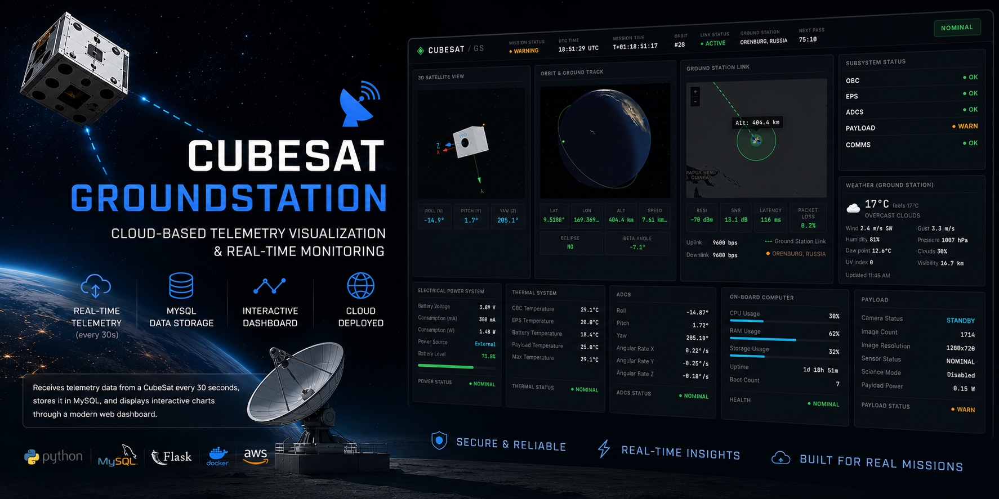

# CubeSat Ground Station

The ground segment of **[CubeSat Sim](https://github.com/miksrv/cubesat-sim)** — a working CubeSat
model built on real hardware, running independent Python services on a Raspberry Pi.

This repository is **one React interface over several data sources**. The same page draws the same
satellite whether the numbers arrive from the satellite's own broker, from a mission replayed out of
its archive, or from a recording bundled with a static build that has no backend at all.



**Architecture:** [`docs/dashboard-architecture.md`](docs/dashboard-architecture.md) — what the four
cases are and why the boundary between the two repositories falls where it does.
**Plan:** [`docs/dashboard-plan.md`](docs/dashboard-plan.md) — the order of work and what is left.

---

## Table of Contents

- [The four cases](#the-four-cases)
- [How the source is chosen](#how-the-source-is-chosen)
- [The contract](#the-contract)
- [What the satellite does not measure](#what-the-satellite-does-not-measure)
- [Project structure](#project-structure)
- [Quick start](#quick-start)
- [Testing](#testing)
- [Deployment](#deployment)
- [What used to be here](#what-used-to-be-here)
- [License](#license)

---

## The four cases

| # | Case | Runs on | Data from |
|---|---|---|---|
| 1 | Live dashboard in `DEMO` / `EXPO` | the satellite | its MQTT bus and SQLite |
| 2 | Mission archive: load a mission, play its timeline | the satellite | its SQLite |
| 3 | Public demo, always reachable | ordinary static hosting | itself — no backend at all |
| 4 | Ground receiver: a Heltec V4 on USB *(later)* | a laptop | a serial link and its own SQLite |

They differ only in where the numbers come from. **The UI must not be able to tell which** — that is
the whole architecture, and everything below follows from it.

## How the source is chosen

By the bundler, at build time:

```bash
yarn build                         # PUBLIC_SOURCE defaults to live — the satellite
PUBLIC_SOURCE=replay yarn build    # the public demo: a recorded mission, no backend
```

`#active-source` is an alias resolved in `rsbuild.config.ts` to either `active.live.ts` or
`active.replay.ts`. The module that is not chosen is never imported and never bundled, so the static
demo carries no MQTT client and the satellite's build carries no recording. A runtime `if (demo)`
would ship both — and, worse, would let a widget depend on which one is running.

| Variable | Default | What it does |
|---|---|---|
| `PUBLIC_SOURCE` | `live` | `live` or `replay` |
| `PUBLIC_BROKER_URL` | `ws://<this host>:9001` | mosquitto's WebSocket listener |
| `PUBLIC_API_BASE` | `/api` | the dashboard service's read-only REST |

**The browser talks to the broker directly.** mosquitto carries a WebSocket listener and the
satellite's `cubesat-dashboard` service serves this page; there is no MQTT-to-WebSocket bridge to
write, test or keep in step with the topic list. Subscribing also replays every retained message, so
a page that has just been opened knows the profile, the battery and the mission before a poll would
have finished. What a browser may publish is an allowlist on the broker's side — `cubesat/command`
and nothing else.

## The contract

`src/features/telemetry/types.ts`, and **the satellite defines it**: every shape there is a column
of `telemetry` or `attitude`, a row of `missions`, or a documented MQTT payload. The authority is
`cubesat-sim` — `src/cubesat/dhs/schema.py` and its README. When the two disagree, this repository
is wrong.

That direction is deliberate: a shape invented here would leave the emulated source faithful to
something that does not exist.

**Null means withheld, and it is never a zero.** The satellite refuses to publish a value it cannot
justify — `yaw` is null until the magnetometer is calibrated, because the BNO055 reports a *constant*
below that rather than a poor estimate; `uv_index` is null until the SEN0501 board revision is known,
because two revisions read one register with formulas that disagree by a factor of forty. Render a
null as absent. Substituting 0 re-introduces exactly the confident wrong number the satellite went
out of its way not to send.

## What the satellite does not measure

Three things this dashboard used to show were removed rather than left dashed out, because a row
that is always empty is a promise that something will fill it:

- **Battery current and wattage.** There is no current sensor, and no shunt or coulomb counter
  either: the gauge is a MAX17040/41, which reads the terminal voltage and reconstructs a state of
  charge from an internal model. What replaced those two rows was `charge_rate`, described here as a
  rate the gauge "really does report" — it does not, and the driver was decoding the `0xFFFF` of an
  unimplemented register into a constant −0.208 %/h. Since the satellite's 2026-09-04 change the
  rate shown is `voltage_rate`, millivolts per hour fitted over the measured voltage, and that is
  what tells "plugged in and charging" from "plugged in and still going down". **Every power
  threshold in this dashboard is a voltage** for the same reason: the gauge's percentage was
  measured falling at 8–10 %/h on mains with the terminal voltage flat to the millivolt, and
  `battery_percent` is now derived from the voltage through an inferred pack curve, for display
  only. The time remaining is the satellite's own estimate and is not recomputed here.
- **Four per-subsystem temperatures.** There are three thermometers and none is on a subsystem
  board: the SoC die, the BNO055 die, and the air.
- **RSSI, SNR, latency, packet loss, bitrate.** The radio is a Heltec running stock Meshtastic,
  which handles framing, retries and encryption itself and reports none of it back over the serial
  link. What COMMS publishes is whether the node answered, whether it may transmit, whether it is
  still listening, and when an uplink last landed.

Two more things are computed here rather than fetched, and are labelled as such wherever they
appear:

- **The orbit is a simulation** (`src/features/orbit/simulate.ts`). The satellite sits on a desk,
  goes to a science fair and rides to work in a backpack; it has no orbit and never will. The
  parameters are the ISS's, rounded — a real orbit rather than numbers chosen to look plausible.
  The *real* position comes from the GNSS receiver, and only from rows where `fix` is true.
- **The mission log is what this page witnessed** (`src/features/events/observed.ts`). The satellite
  keeps no events table. The log starts empty on every load and says so, because nothing recorded
  what came before.

## Project structure

```
client/
├── src/
│   ├── features/
│   │   ├── telemetry/
│   │   │   ├── types.ts            # the contract — from the satellite's schema
│   │   │   ├── decode.ts           # wire (snake_case, nulls) -> domain, once
│   │   │   ├── source.ts           # the interface every source implements
│   │   │   ├── useSource.ts        # the hooks; attitude goes into a ref
│   │   │   ├── recordings/         # the bundled mission the demo replays
│   │   │   └── sources/
│   │   │       ├── live.ts         # MQTT over WebSockets + REST for the archive
│   │   │       ├── replay.ts       # a recording, no backend of any kind
│   │   │       ├── active.live.ts  # the two halves of the build-time swap
│   │   │       └── active.replay.ts
│   │   ├── orbit/                  # the simulation, said out loud
│   │   ├── events/                 # the log built from observed transitions
│   │   └── weather/                # the one thing here that is not the satellite
│   ├── components/                 # widgets: plain props, no idea where data came from
│   └── utils/subsystemStatus.ts    # health, derived from what is actually published
└── scripts/                        # the placeholder recording generator
```

## Quick start

```bash
cd client
yarn install
yarn dev                       # http://localhost:3000
```

With no satellite on the network the live source simply finds no broker: the page renders, the
panels say what they do not know, and nothing hangs. To see it full of data without a satellite:

```bash
PUBLIC_SOURCE=replay yarn dev
```

Against a real satellite on the LAN:

```bash
PUBLIC_BROKER_URL=ws://cubesat.local:9001 yarn dev
```

## Testing

```bash
cd client
yarn test              # jest
yarn eslint:check
yarn prettier:check
```

Tests need neither a broker nor a server. `src/test-source.ts` installs a fake implementation of
the source interface, pushes state by hand, and the widgets are asserted on what they drew — which
is the cheapest possible proof that the abstraction holds.

## Deployment

**The public demo** is built with `PUBLIC_SOURCE=replay` and mirrored to ordinary hosting by
`.github/workflows/deploy.yml`. It must work with no rewrite rules, which holds while there is no
`react-router`; if addressable mission URLs are ever wanted, hash routing is the only option that
keeps it true.

**The satellite's copy** is not deployed from here. `client/dist`, built with `PUBLIC_SOURCE=live`,
is copied onto the Pi and served by the `cubesat-dashboard` service from `CUBESAT_DASHBOARD_ROOT`.
Building React on a Pi 4 costs minutes and a `node_modules` tree on the SD card to produce a few
megabytes of static files, so the artefact travels rather than the source.

## What used to be here

A PHP/CodeIgniter 4 backend and a MySQL database. The satellite POSTed telemetry to it every 30
seconds and this React client read it back.

That leg is gone, in both repositories. No cloud service was ever deployed and none is planned:
`downlink.api` and the `CloudApi` code have been removed from the satellite too. The consequence is
worth stating plainly — **telemetry now lives only on the satellite's card**, and the mission export
endpoint is what gets a copy off it. That same export is what the public demo replays.

⚠️ The recording currently bundled with the demo is a **placeholder**, generated by
`client/scripts/make-placeholder-recording.mjs`. It reproduces the awkward parts of real telemetry
on purpose — a withheld heading, a null UV index, a fix that drops and leaves the coordinates stale
— but nothing has run on the Raspberry Pi yet, so there is no real export to bundle. Replace it with
the first one.

## License

See [LICENSE](LICENSE).
