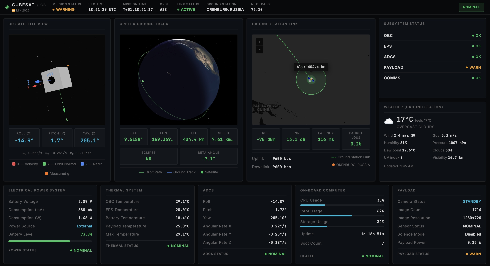

# CubeSat Ground Station

CubeSat Ground Station is the cloud-side counterpart to **[CubeSat Sim](https://github.com/miksrv/cubesat-sim)**, a
working flight-software stack running on real Raspberry Pi hardware. The CubeSat's onboard COMMS service reports
telemetry from its OBC, EPS, ADCS, and Payload subsystems over HTTP; this repository ingests those packets, persists
them in MySQL, and serves them to a React dashboard that visualizes mission state, subsystem health, and orbit
tracking in near real time.


The two repositories form a single system: [CubeSat Sim](https://github.com/miksrv/cubesat-sim) is the satellite
side (or its physical hardware analogue), and `cubesat-groundstation` is the mission-control side. Neither is
useful in isolation for demonstrating end-to-end telemetry flow — this repo can run against simulated data on its
own, but is designed to receive live packets from the companion project.

**Project board:** [GitHub Projects #8](https://github.com/users/miksrv/projects/8/) ·
**Companion project:** [CubeSat Sim](https://github.com/miksrv/cubesat-sim)

---

## Table of Contents

- [Integration with CubeSat Sim](#integration-with-cubesat-sim)
- [Architecture](#architecture)
- [Tech Stack](#tech-stack)
- [Project Structure](#project-structure)
- [Quick Start](#quick-start)
- [API Reference](#api-reference)
- [Testing](#testing)
- [Documentation](#documentation)
- [Roadmap](#roadmap)
- [Contributing](#contributing)
- [License](#license)

---

## Integration with CubeSat Sim

[CubeSat Sim](https://github.com/miksrv/cubesat-sim) runs five independent services (OBC, EPS, ADCS, Payload,
COMMS) communicating over a local MQTT broker on the satellite hardware. The COMMS service is the only one that
talks to the outside world: every 30 seconds it assembles a packet from the other subsystems' cached telemetry plus
its own system-health metrics, and — when its `api_enabled` flag is on and connectivity is confirmed — POSTs that
packet to this ground station's `POST /api/cubesat/telemetry` endpoint.

This ground station is intentionally the passive side of that link:

- It never initiates contact with the CubeSat. All data arrives via inbound HTTP POST from COMMS.
- The telemetry schema mirrors the CubeSat's internal packet structure (`eps`, `adcs`, `payload`, `system`, `obc`,
  `gps` groups) so packets can be stored with minimal transformation — see
  [Message Payloads](https://github.com/miksrv/cubesat-sim#message-payloads) in the CubeSat Sim README for the
  wire format COMMS produces.
- CubeSat Sim's COMMS service also polls this ground station for queued ground commands. That contract
  (`GET /api/cubesat/commands/pending` or equivalent) is not implemented on this side yet; the `commands` API
  currently only stores simulated commands issued from this dashboard (see
  [API Reference](#api-reference)) and does not yet dispatch them back to real hardware.
- Everything in this repository also works standalone against seeded or synthetic telemetry, which is how the
  frontend is developed and tested without a physical CubeSat attached.

---

## Architecture

```
┌────────────────────┐        ┌────────────────────┐        ┌────────────────────┐
│    CubeSat Sim     │        │   Ground Station   │        │   Ground Station   │
│   (cubesat-sim)    │        │      Backend       │        │      Frontend      │
│                    │        │                    │        │                    │
│   COMMS service    │ HTTP  ►│ PHP CodeIgniter 4  │ HTTP  ►│  React + Three.js  │
│  (SQLite cache +   │        │      + MySQL       │        │     dashboard      │
│  MQTT internally)  │        │      REST API      │        │  Widgets + charts  │
└────────────────────┘        └────────────────────┘        └────────────────────┘
```

COMMS POSTs a telemetry packet every 30 seconds; the frontend polls the backend on the same interval.

### Data flow

1. CubeSat Sim's OBC, EPS, ADCS, and Payload subsystems publish status over local MQTT.
2. COMMS aggregates the latest reading from each subsystem plus system-health metrics into a single packet.
3. Every 30 seconds, COMMS POSTs that packet to `POST /api/cubesat/telemetry` on this backend.
4. The backend validates and stores the packet in MySQL, then exposes it through `latest`, `history`, and `range`
   read endpoints, alongside separately tracked mission events, orbit state, and simulated commands.
5. The frontend polls the backend every 30 seconds and renders it as a widget-based mission-control dashboard,
   including a 3D orbit and ground-track globe.

---

## Tech Stack

### Backend (`/server`)
- PHP 8.2+ with CodeIgniter 4.7
- MySQL 8.0
- PHPUnit 10 for testing
- RESTful JSON API under `Api\*Controller` classes

### Frontend (`/client`)
- **Build tool:** Rsbuild (with the Sass plugin)
- **Framework:** React 19, TypeScript
- **State management:** Redux Toolkit with RTK Query
- **2D charts:** Apache ECharts
- **3D rendering:** three.js, @react-three/fiber, @react-three/drei — used for the orbit and ground-track globe
- **Maps:** Leaflet / react-leaflet for the ground-station link map
- **UI kit:** simple-react-ui-kit, with a SASS-based dark theme
- **Testing:** Jest, React Testing Library, Cypress

---

## Project Structure

```
cubesat-groundstation/
├── server/                        # Backend (CodeIgniter 4)
│   ├── app/
│   │   ├── Controllers/Api/       # TelemetryController, EventsController,
│   │   │                          # CommandsController, OrbitController
│   │   ├── Models/                 # Database models
│   │   ├── Database/                # Migrations
│   │   └── Config/Routes.php        # API route definitions
│   ├── docs/api.md                  # Backend API notes
│   └── tests/                        # PHPUnit tests
│
├── client/                        # Frontend (React + Rsbuild)
│   └── src/
│       ├── app/                     # Redux store
│       ├── features/telemetry/      # RTK Query API slice, types
│       ├── components/              # Mission-control widgets (see below)
│       ├── three/                   # Shared three.js material/scene helpers
│       ├── styles/                  # SASS design system
│       └── assets/earth/            # Day/night Earth textures for the globe
│
├── docker/                        # Docker configuration
│   ├── mysql/                       # MySQL init scripts
│   └── README.md                    # Docker setup guide
│
├── docs/
│   └── CubeSat_Groundstation.postman_collection.json  # Importable API request collection
│
├── requirements/                  # Feature specifications (feature_1.md – feature_7.md)
├── .claude/agents/                 # AI agent instructions
├── docker-compose.yml              # MySQL container definition
├── ROADMAP.md                      # Project roadmap and feature history
└── CLAUDE.md                       # AI team-lead instructions for this repo
```

The dashboard's widget set (under `client/src/components/`) includes `MissionStatusBar`, `Satellite3DView`,
`OrbitGroundTrack`, `GroundStationLinkMap`, `PowerSystemWidget`, `ThermalSystemWidget`, `ADCSWidget`,
`OBCSystemWidget`, `PayloadWidget`, `MissionEventsWidget`, `MissionConsoleWidget`, `QuickCommandsWidget`,
`TelemetryGraphsWidget`, `LiveTelemetryStreamWidget`, `MqttBusMonitorWidget`, `RecentAlertsWidget`,
`SubsystemStatusWidget`, `OrbitInfoWidget`, and `WeatherWidget` — see
[requirements/feature_7.md](requirements/feature_7.md) for the design this layout implements.



---

## Quick Start

### Prerequisites
- PHP 8.2+ with Composer
- MySQL 8.0 **or** Docker (recommended)
- Node.js 18+ with [Yarn 4](https://yarnpkg.com/getting-started/install) (the client is pinned to `yarn@4.9.2` via
  Corepack, not npm)
- Git

### 1. Clone the repository

```bash
git clone https://github.com/miksrv/cubesat-groundstation.git
cd cubesat-groundstation
```

### 2. Start MySQL (Docker, recommended)

```bash
docker compose up -d
docker compose ps
docker compose logs cubesat
```

**Database credentials:**
- Host: `localhost:3306`
- Database: `cubesat_groundstation`
- User: `cubesat_user`
- Password: `cubesat_password`

### 3. Backend setup

```bash
cd server
composer install
cp env .env

# Configure database credentials in .env (use the Docker values above), then:
php spark migrate
php spark serve
# API available at http://localhost:8080
```

### 4. Frontend setup

```bash
cd client
yarn install

# The dev-server API proxy is configured in rsbuild.config.ts, not via .env.
# It defaults to a remote demo API — point it at http://localhost:8080 for
# local backend development.

yarn dev
# Dashboard available at http://localhost:3000
```

### Running tests

```bash
# Backend
cd server
./vendor/bin/phpunit

# Frontend
cd client
yarn test
```

> Cypress E2E specs exist under `client/cypress/e2e/`, but the `cypress` package is not installed yet
> (`yarn add -D cypress` first) — see [ROADMAP.md](ROADMAP.md), Feature 5.

---

## API Reference

| Method | Endpoint | Controller | Description |
|--------|----------|------------|-------------|
| `POST` | `/api/cubesat/telemetry` | `TelemetryController::store` | Store a telemetry packet |
| `GET` | `/api/cubesat/telemetry/latest` | `TelemetryController::latest` | Latest telemetry record |
| `GET` | `/api/cubesat/telemetry/history` | `TelemetryController::history` | Last N telemetry records |
| `GET` | `/api/cubesat/telemetry/range` | `TelemetryController::range` | Records within a time range |
| `GET` | `/api/cubesat/events` | `EventsController::index` | Mission event log (state transitions, commands, deployments) |
| `POST` | `/api/cubesat/commands` | `CommandsController::store` | Submit a simulated ground command |
| `GET` | `/api/cubesat/orbit` | `OrbitController::index` | Current orbit state for the ground-track globe |

**Example telemetry payload:**

```json
{
  "timestamp": "2026-07-30T12:00:00Z",
  "eps": { "battery": 82.1, "voltage": 8.14, "external_power": 1 },
  "adcs": {
    "roll": 2.31, "pitch": -1.24, "yaw": 5.67, "imu_temp": 27.4,
    "accel_g": { "x": 0.01, "y": -0.02, "z": 0.0 },
    "gyro_dps": { "x": 0.1, "y": -0.1, "z": 0.0 }
  },
  "payload": { "temperature": 23.0, "humidity": 50.0, "pressure": 1000.0 },
  "system": { "cpu_percent": 34.0, "ram_percent": 52.0, "disk_percent": 41.0 },
  "obc_state": "NOMINAL",
  "gps": { "latitude": 55.7961, "longitude": 49.1087, "altitude": 512.4 }
}
```

This mirrors the packet structure COMMS assembles in
[CubeSat Sim](https://github.com/miksrv/cubesat-sim#message-payloads). See
[requirements/feature_7.md](requirements/feature_7.md) for the full additive API contract, including the thermal,
comms, and payload fields added alongside the mission-control redesign.

See the [Postman collection](docs/CubeSat_Groundstation.postman_collection.json) for ready-to-run request examples.

---

## Testing

- **Backend:** PHPUnit, run against the Docker MySQL instance
- **Frontend:** Jest and React Testing Library for component tests; Cypress specs are written but not yet wired
  into CI (see [ROADMAP.md](ROADMAP.md), Feature 5)
- **Target coverage:** Backend 80%, Frontend 75% (tracked, not yet enforced in CI)

---

## Documentation

- [server/docs/api.md](server/docs/api.md) — backend API notes
- [Postman collection](docs/CubeSat_Groundstation.postman_collection.json) — ready-to-import API requests
- [ROADMAP.md](ROADMAP.md) — feature history, task status, and technical notes per feature
- [requirements/](requirements/) — feature specifications, `feature_1.md` through `feature_7.md`
- [CubeSat Sim](https://github.com/miksrv/cubesat-sim) — the flight-software stack this ground station receives
  telemetry from

> Dedicated architecture and deployment guides under `docs/` are planned (see [ROADMAP.md](ROADMAP.md), Feature 6)
> but not written yet — this README, `server/docs/api.md`, and the Postman collection are the current source of
> truth.

---

## Roadmap

Full history and per-feature task tracking live in [ROADMAP.md](ROADMAP.md). At a glance:

- **Feature 1 — Backend API:** complete
- **Feature 2 — Frontend dashboard:** complete
- **Feature 3 — Refactoring:** complete
- **Feature 4 — Refactoring UI:** complete
- **Feature 5 — QA and testing:** not started
- **Feature 6 — Documentation:** not started
- **Feature 7 — Mission Control dashboard redesign:** in progress — widget-based layout, mission events, simulated
  commands, and the 3D orbit/ground-track globe (see [requirements/feature_7.md](requirements/feature_7.md))

---

## Contributing

This project uses an AI-driven development workflow with specialized agents, coordinated through GitHub Projects
cards rather than issues:

- **Backend Agent** — PHP/CodeIgniter development (`/server`)
- **Frontend Agent** — React/TypeScript development (`/client`)
- **QA Agent** — testing and quality assurance (`/server/tests`, `/client/src/tests`)
- **Doc Agent** — documentation (`/docs`, `README.md`)

See [CLAUDE.md](CLAUDE.md) for the full team workflow and card-status conventions.

---

## License

This project is licensed under the MIT License — see [LICENSE](LICENSE) for details.
