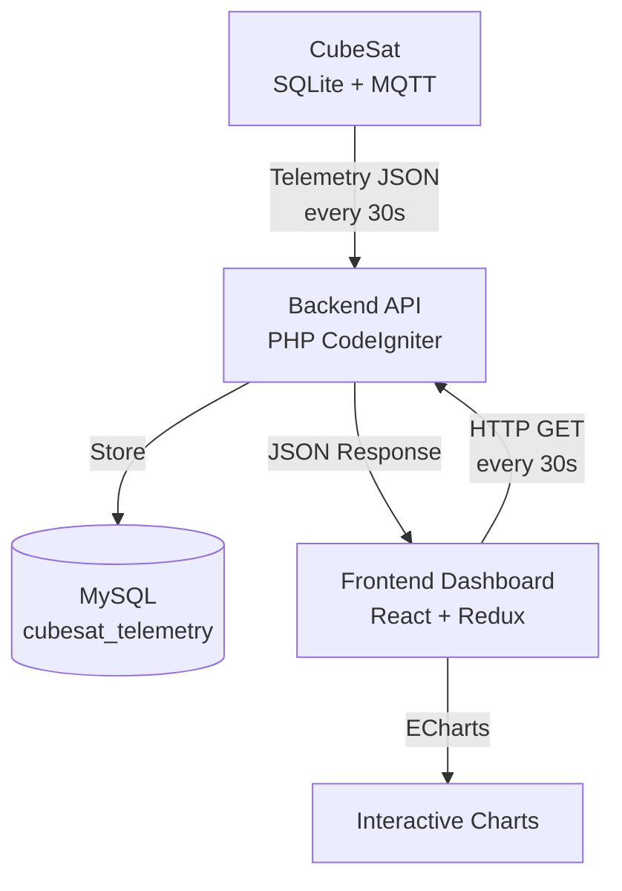
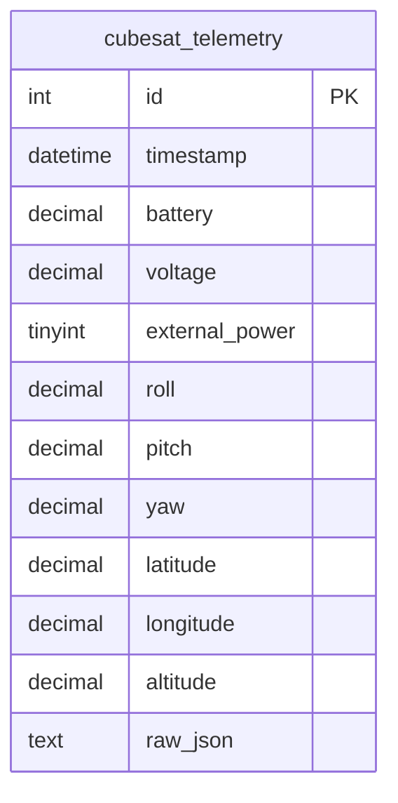

# Feature 4: Documentation

## Goal
Provide comprehensive documentation for project architecture, API, deployment, and usage to enable easy onboarding and maintenance.

## Documentation Structure

```
docs/
├── architecture/
│   ├── system-overview.md
│   ├── data-flow.md
│   ├── cubesat-communication.md
│   └── diagrams/
│       ├── system-architecture.mmd
│       ├── database-schema.mmd
│       ├── api-flow.mmd
│       └── frontend-structure.mmd
├── api/
│   ├── endpoints.md
│   ├── payload-examples.md
│   └── error-codes.md
├── frontend/
│   ├── components.md
│   ├── redux-store.md
│   ├── charts-guide.md
│   └── theming.md
├── deployment/
│   ├── backend-setup.md
│   ├── frontend-setup.md
│   ├── database-setup.md
│   └── docker-compose.yml
├── development/
│   ├── getting-started.md
│   ├── coding-standards.md
│   └── testing-guide.md
└── user-guide/
    ├── dashboard-usage.md
    └── troubleshooting.md
```

## Required Documentation

### 1. Architecture Documentation

#### System Overview (`architecture/system-overview.md`)
- High-level system architecture
- CubeSat Ground Station purpose
- Component relationships
- Technology stack explanation

#### Data Flow (`architecture/data-flow.md`)
- CubeSat → Backend flow
- Backend → Database flow
- Frontend → Backend API flow
- Real-time update mechanism

#### CubeSat Communication (`architecture/cubesat-communication.md`)
- MQTT topics structure
- Telemetry packet format
- OBC state machine states
- Subsystem descriptions (OBC, EPS, ADCS, Payload, etc.)

#### Mermaid Diagrams

**System Architecture Diagram:**


**Database Schema Diagram:**


### 2. API Documentation

#### Endpoints Reference (`api/endpoints.md`)
```markdown
## POST /api/cubesat/telemetry
Store telemetry data from CubeSat

**Request Body:**
[JSON schema with all fields]

**Response:**
200 OK - Success
400 Bad Request - Invalid JSON
500 Internal Server Error

## GET /api/cubesat/telemetry/latest
Get most recent telemetry record

## GET /api/cubesat/telemetry/history?limit=N
Get last N telemetry records

## GET /api/cubesat/telemetry/range?from=...&to=...
Get telemetry for time range
```

#### Payload Examples (`api/payload-examples.md`)
- Complete valid JSON examples
- Examples for each OBC state
- Edge case examples
- Invalid payload examples

#### Error Codes (`api/error-codes.md`)
- HTTP status codes
- Error response format
- Common errors and solutions

### 3. Frontend Documentation

#### Components Guide (`frontend/components.md`)
- Component tree structure
- Props interfaces
- Usage examples
- Component lifecycle

#### Redux Store (`frontend/redux-store.md`)
- Store structure
- Slices documentation
- Actions and reducers
- RTK Query setup

#### Charts Guide (`frontend/charts-guide.md`)
- ECharts configuration
- Chart types used
- Customization guide
- Performance optimization

#### Theming (`frontend/theming.md`)
- SASS variables
- Dark theme implementation
- Color palette
- Responsive breakpoints

### 4. Deployment Documentation

#### Backend Setup (`deployment/backend-setup.md`)
```markdown
# Backend Deployment

## Requirements
- PHP 8.1+
- MySQL 8.0+
- Composer

## Installation Steps
1. Clone repository
2. Install dependencies: `composer install`
3. Configure database in `config/database.php`
4. Run migrations: `php spark migrate`
5. Start server: `php spark serve`

## Production Configuration
[Nginx/Apache config examples]
```

#### Frontend Setup (`deployment/frontend-setup.md`)
```markdown
# Frontend Deployment

## Requirements
- Node.js 18+
- npm or yarn

## Installation Steps
1. Install dependencies: `npm install`
2. Configure API endpoint in `.env`
3. Build: `npm run build`
4. Serve static files

## Environment Variables
[List of all env vars]
```

#### Docker Compose (`deployment/docker-compose.yml`)
```yaml
version: '3.8'
services:
  mysql:
    image: mysql:8.0
    environment:
      MYSQL_ROOT_PASSWORD: ...
      MYSQL_DATABASE: cubesat_groundstation
    
  backend:
    build: ./server
    depends_on:
      - mysql
    
  frontend:
    build: ./client
    depends_on:
      - backend
```

### 5. Development Documentation

#### Getting Started (`development/getting-started.md`)
- Prerequisites
- Local development setup
- Running tests
- Debugging tips

#### Coding Standards (`development/coding-standards.md`)
- PHP coding standards (PSR-12)
- TypeScript/React standards
- SASS conventions
- Git commit message format

#### Testing Guide (`development/testing-guide.md`)
- How to write tests
- Test data fixtures
- Running specific tests
- Coverage reports

### 6. User Guide

#### Dashboard Usage (`user-guide/dashboard-usage.md`)
- Dashboard overview
- Chart interpretations
- Status indicators
- Data export features

#### Troubleshooting (`user-guide/troubleshooting.md`)
- Common issues
- Connection problems
- Data not updating
- Performance issues

## README.md Updates

Update main `README.md` with:
- Project badges (build status, coverage)
- Quick start guide
- Architecture overview
- Links to detailed docs
- Contributing guidelines
- License information

## Micro-tasks

### Architecture Documentation (6 tasks)
1. Write system overview document
2. Create system architecture Mermaid diagram
3. Document data flow with diagrams
4. Create database schema diagram
5. Document CubeSat communication protocol
6. Create frontend structure diagram

### API Documentation (4 tasks)
7. Document all API endpoints with examples
8. Create JSON payload examples for all scenarios
9. Document error codes and responses
10. Create Postman/Insomnia collection

### Frontend Documentation (4 tasks)
11. Document component structure and usage
12. Document Redux store architecture
13. Create ECharts configuration guide
14. Document theming and styling system

### Deployment Documentation (4 tasks)
15. Write backend deployment guide
16. Write frontend deployment guide
17. Create Docker Compose configuration
18. Write database setup and migration guide

### Development Documentation (3 tasks)
19. Write development setup guide
20. Document coding standards and conventions
21. Create comprehensive testing guide

### User Documentation (3 tasks)
22. Write dashboard user guide
23. Create troubleshooting guide
24. Update main README.md

## Documentation Standards

- Use Markdown for all docs
- Include Mermaid diagrams for architecture
- Add code examples with syntax highlighting
- Keep docs up-to-date with code changes
- Use clear, concise language
- Add screenshots for UI documentation
- Include links between related docs

## Success Criteria
- ✅ All architecture diagrams created
- ✅ All API endpoints documented with examples
- ✅ Deployment guides tested and verified
- ✅ README.md is comprehensive
- ✅ All components documented
- ✅ Docker Compose works out of the box
- ✅ New developers can set up project in < 30 minutes
